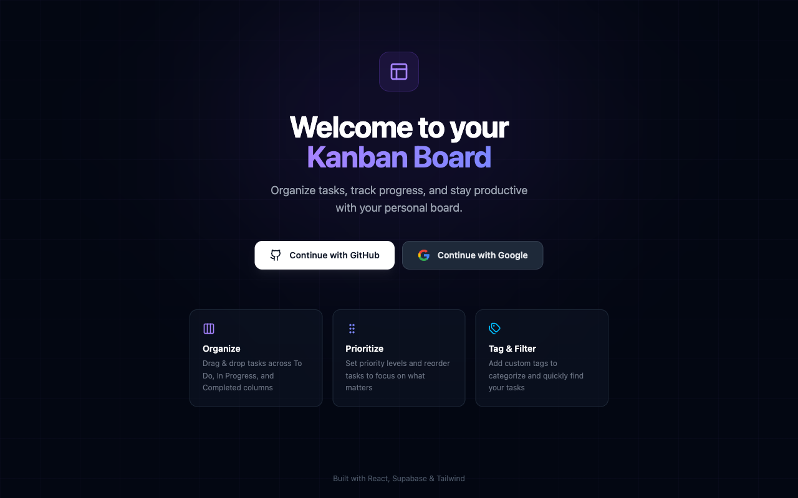

# Kanban Board

A personal Kanban board with drag-and-drop, OAuth login, and real-time sync via Supabase.



## Features

- **Drag & Drop** - Move tasks between columns (To Do, In Progress, Completed) or reorder within a column using @dnd-kit
- **OAuth Login** - Sign in with GitHub or Google via Supabase Auth
- **Task Management** - Create, edit, and delete tasks with title, description, priority, and tags
- **Priority Levels** - Color-coded badges: Low, Medium, High
- **Custom Tags** - Categorize tasks with multiple tags
- **Dark Theme** - Modern dark UI with violet accents
- **Persistent Storage** - Data stored in Supabase PostgreSQL with Row Level Security

## Tech Stack

| Layer | Technology |
|-------|-----------|
| Frontend | React 19, TypeScript, Vite |
| Styling | Tailwind CSS 4 |
| Drag & Drop | @dnd-kit |
| Auth & DB | Supabase (PostgreSQL + Auth) |
| Hosting | Vercel |

## Getting Started

```bash
# Install dependencies
npm install

# Copy env template and add your Supabase credentials
cp .env.example .env

# Start development server
npm run dev
```

## Environment Variables

| Variable | Description |
|----------|-------------|
| `VITE_SUPABASE_URL` | Supabase project URL |
| `VITE_SUPABASE_ANON_KEY` | Supabase anon/public key |

## Database Setup

1. Create a [Supabase](https://supabase.com) project
2. Run the migration in **SQL Editor**:

```bash
# Paste contents of supabase-migration.sql
```

This creates tables (`columns`, `tasks`, `tags`, `task_tags`), RLS policies, and helper functions.

3. Enable **GitHub** and/or **Google** under **Authentication > Sign In / Providers**

## Project Structure

```
src/
├── components/
│   ├── WelcomePage.tsx    # Landing page with OAuth buttons
│   ├── Board.tsx          # Main Kanban board
│   ├── Column.tsx         # Droppable column container
│   ├── TaskCard.tsx       # Draggable task card
│   ├── TaskModal.tsx      # Create/edit task modal
│   ├── PriorityBadge.tsx  # Priority indicator
│   └── TagBadge.tsx       # Tag pill
├── hooks/
│   └── useBoard.ts        # Board state + Supabase sync
├── lib/
│   ├── supabase.ts        # Supabase client
│   └── database.types.ts  # Generated DB types
├── types/                 # TypeScript interfaces
└── utils/                 # Storage utilities
```

## Docker

```bash
cp .env.example .env
docker compose up --build
```

Open `http://localhost:5173`.

## License

MIT
