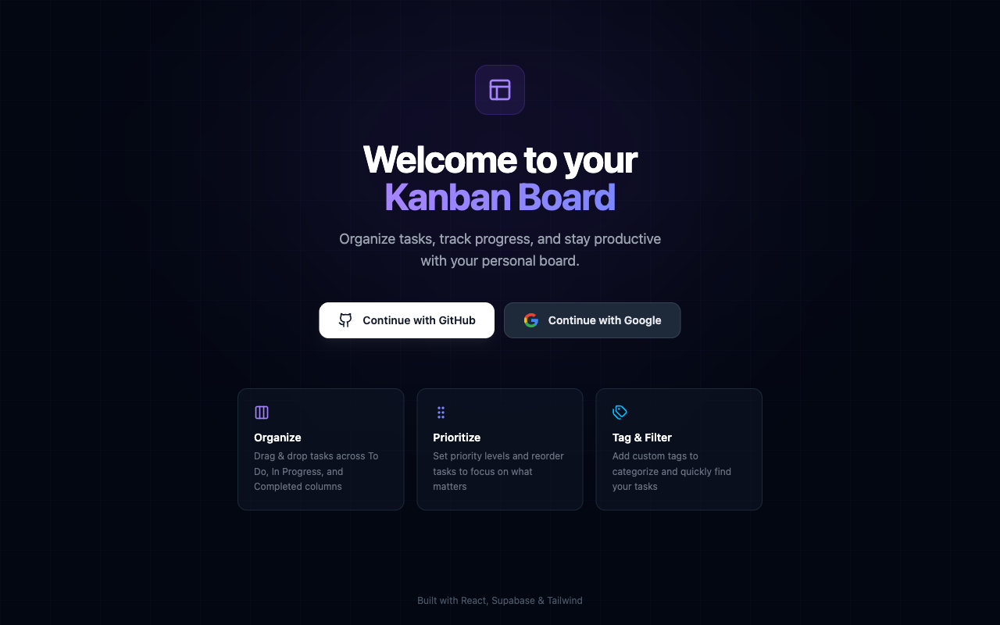

<div align="center">

# Kanban Board

[](https://react.dev)
[](https://www.typescriptlang.org)
[](https://vite.dev)
[](https://tailwindcss.com)
[](https://supabase.com)
[](LICENSE)
[](Dockerfile)

**A personal Kanban board with drag-and-drop, OAuth login, and real-time sync via Supabase.**

[Report Bug](https://github.com/alfredang/kanban/issues) · [Request Feature](https://github.com/alfredang/kanban/issues)

</div>

## Screenshot



## About

Kanban Board is a lightweight, modern task management app that helps you organize work across customizable columns. It features smooth drag-and-drop powered by @dnd-kit, secure OAuth authentication through Supabase, and persistent storage with PostgreSQL and Row Level Security.

### Key Features

- **Drag & Drop** — Move tasks between columns (To Do, In Progress, Completed) or reorder within a column using @dnd-kit
- **OAuth Login** — Sign in with GitHub or Google via Supabase Auth
- **Task Management** — Create, edit, and delete tasks with title, description, priority, and tags
- **Priority Levels** — Color-coded badges: Low, Medium, High
- **Custom Tags** — Categorize tasks with multiple tags
- **Dark Theme** — Modern dark UI with violet accents
- **Persistent Storage** — Data stored in Supabase PostgreSQL with Row Level Security

## Tech Stack

| Layer | Technology |
|-------|-----------|
| Frontend | React 19, TypeScript, Vite 7 |
| Styling | Tailwind CSS 4 |
| Drag & Drop | @dnd-kit (core + sortable) |
| Auth & Database | Supabase (PostgreSQL + OAuth) |
| Icons | Lucide React |
| Hosting | Vercel |
| Containerization | Docker |

## Architecture

```
┌─────────────────────────────────────────────┐
│                   Browser                   │
│  ┌────────────┐  ┌──────────┐              │
│  │ WelcomePage│  │  Board   │              │
│  │  (OAuth)   │  │(Columns) │              │
│  └─────┬──────┘  └────┬─────┘              │
│        │              │                    │
│        └──────┬───────┘                    │
│               │                            │
│        ┌──────┴──────┐                     │
│        │  useBoard   │  React Hooks        │
│        └──────┬──────┘                     │
└───────────────┼────────────────────────────┘
                │ HTTPS
┌───────────────┼────────────────────────────┐
│        ┌──────┴──────┐                     │
│        │  Supabase   │                     │
│        │   Client    │                     │
│        └──────┬──────┘                     │
│               │                            │
│   ┌───────────┼───────────┐                │
│   │           │           │                │
│ ┌─┴──┐  ┌────┴────┐  ┌───┴────┐           │
│ │Auth│  │PostgreSQL│  │  RLS   │           │
│ │OAuth│ │  Tables  │  │Policies│           │
│ └────┘  └─────────┘  └────────┘           │
│              Supabase                      │
└────────────────────────────────────────────┘
```

## Project Structure

```
src/
├── components/
│   ├── WelcomePage.tsx    # Landing page with OAuth buttons
│   ├── Board.tsx          # Main Kanban board
│   ├── Column.tsx         # Droppable column container
│   ├── TaskCard.tsx       # Draggable task card
│   ├── TaskModal.tsx      # Create/edit task modal
│   ├── PriorityBadge.tsx  # Priority indicator
│   └── TagBadge.tsx       # Tag pill
├── hooks/
│   └── useBoard.ts        # Board state + Supabase sync
├── lib/
│   ├── supabase.ts        # Supabase client
│   └── database.types.ts  # Generated DB types
├── types/                 # TypeScript interfaces
└── utils/                 # Storage utilities
```

## Getting Started

### Prerequisites

- Node.js 18+
- A [Supabase](https://supabase.com) project

### Installation

```bash
# Clone the repository
git clone https://github.com/alfredang/kanban.git
cd kanban

# Install dependencies
npm install

# Copy env template and add your Supabase credentials
cp .env.example .env

# Start development server
npm run dev
```

### Environment Variables

| Variable | Description |
|----------|-------------|
| `VITE_SUPABASE_URL` | Supabase project URL |
| `VITE_SUPABASE_ANON_KEY` | Supabase anon/public key |

### Database Setup

1. Create a [Supabase](https://supabase.com) project
2. Run the migration in **SQL Editor** — paste the contents of `supabase-migration.sql`
3. Enable **GitHub** and/or **Google** under **Authentication > Sign In / Providers**
4. Set the Site URL and Redirect URLs under **Authentication > URL Configuration**

## Deployment

### Vercel

Deploy instantly to Vercel — set `VITE_SUPABASE_URL` and `VITE_SUPABASE_ANON_KEY` as environment variables.

### Docker

```bash
cp .env.example .env
# Edit .env with your Supabase credentials
docker compose up --build
```

Open `http://localhost:5173`.

## Contributing

1. Fork the repository
2. Create a feature branch (`git checkout -b feature/amazing-feature`)
3. Commit your changes (`git commit -m 'Add amazing feature'`)
4. Push to the branch (`git push origin feature/amazing-feature`)
5. Open a Pull Request

## Acknowledgements

- [React](https://react.dev) — UI library
- [@dnd-kit](https://dndkit.com) — Drag and drop toolkit
- [Supabase](https://supabase.com) — Backend as a service
- [Tailwind CSS](https://tailwindcss.com) — Utility-first CSS
- [Lucide](https://lucide.dev) — Icon library
- [Vite](https://vite.dev) — Build tool

## License

MIT
